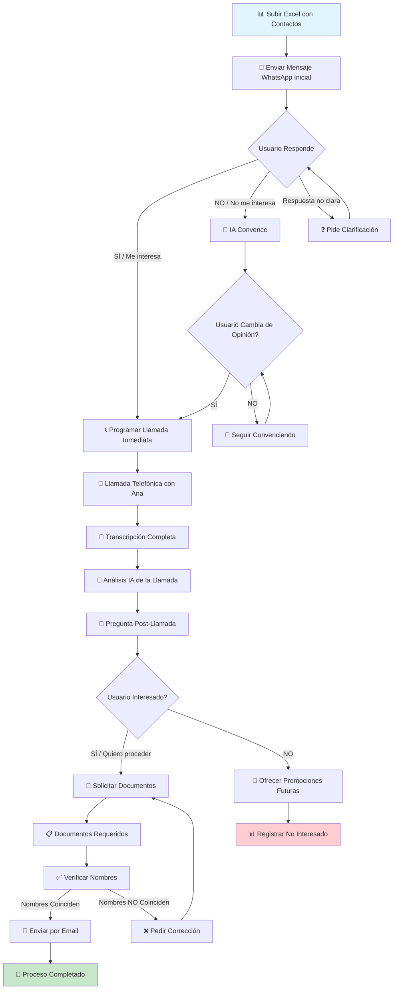
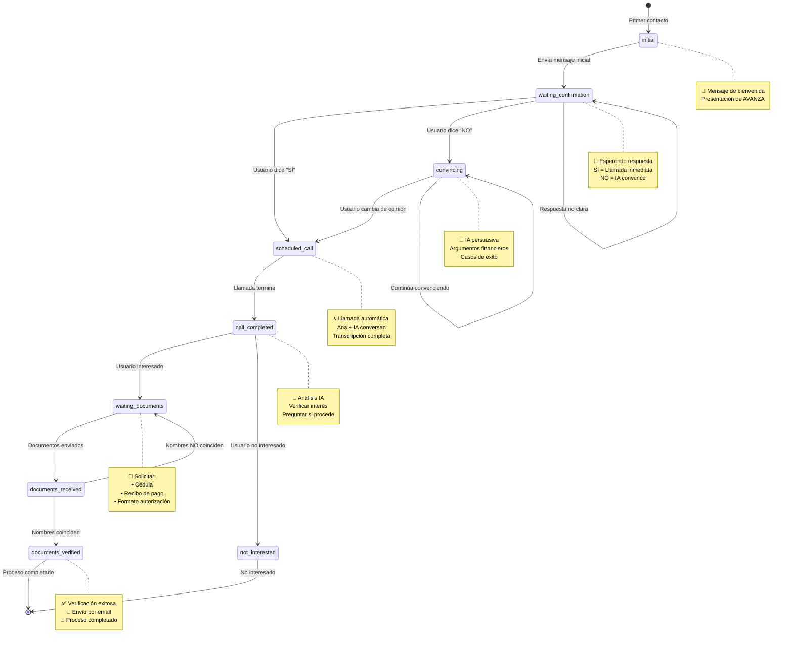
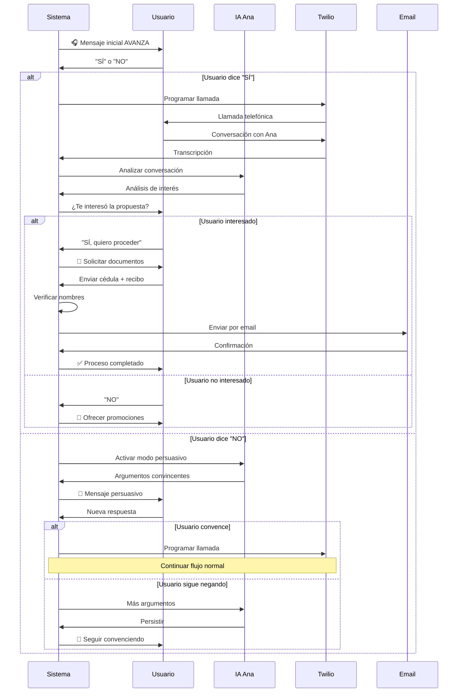
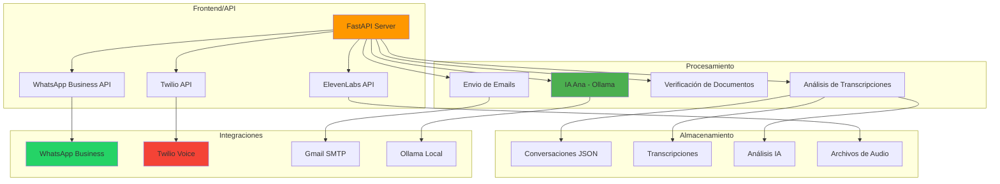
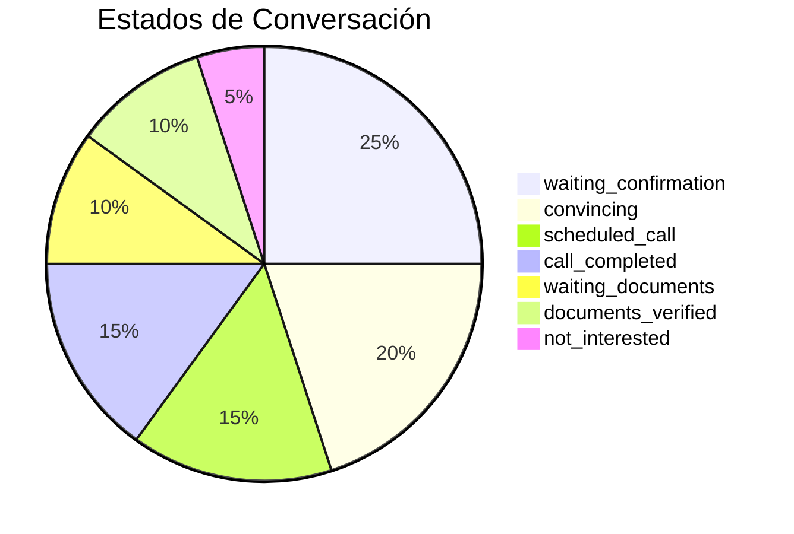
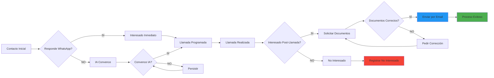
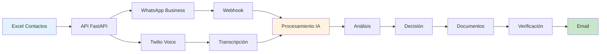

# 🔄 Diagrama de Flujo Completo - AVANZA

## 📊 Flujo Principal del Sistema

## 🎯 Estados de Conversación Detallados

## 📱 Flujo de Mensajes WhatsApp

## 🔧 Arquitectura del Sistema

## 📊 Métricas y Estados

## 🎯 Puntos de Decisión Clave

## 🔄 Flujo de Datos

---

## 📋 Resumen del Flujo Completo

### **Fase 1: Contacto Inicial**
1. 📊 Subir Excel con contactos
2. 📱 Enviar mensaje WhatsApp personalizado
3. 🤖 Procesar respuesta del usuario

### **Fase 2: Persuasión Inteligente**
1. 🎯 Si dice "NO" → IA convence
2. 🔄 Persistencia hasta convencer
3. 📞 Programar llamada cuando acepte

### **Fase 3: Llamada Telefónica**
1. 🎤 Ana habla con IA en tiempo real
2. 📝 Transcripción completa
3. 🧠 Análisis automático con IA

### **Fase 4: Seguimiento Post-Llamada**
1. 📱 Preguntar si se interesó
2. 📄 Solicitar documentos si dice "SÍ"
3. ✅ Verificar nombres en documentos

### **Fase 5: Finalización**
1. 📧 Enviar por correo si coinciden
2. 🎉 Proceso completado
3. 📊 Registrar métricas

**¡El sistema está completamente automatizado y optimizado para máxima conversión!** 🚀 